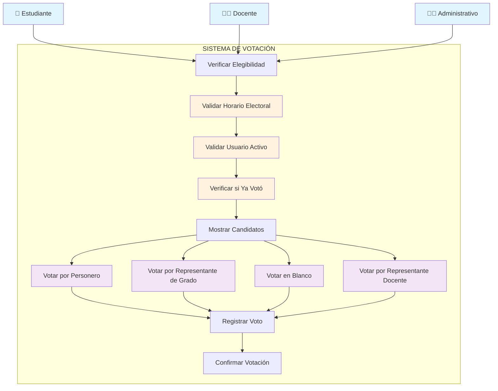
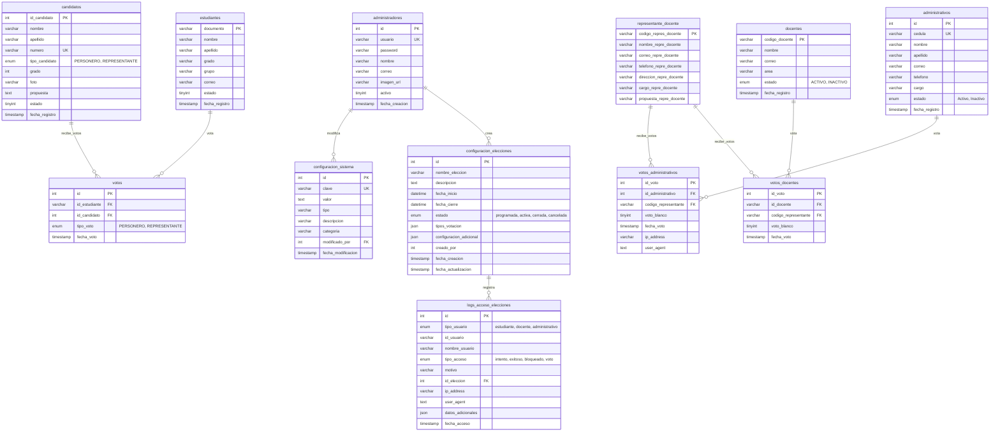
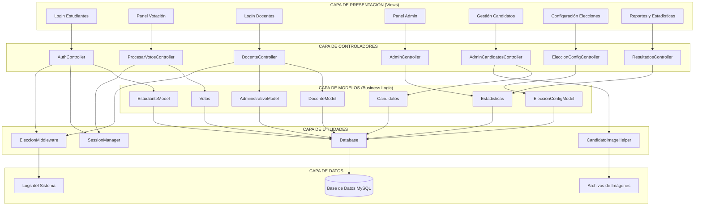
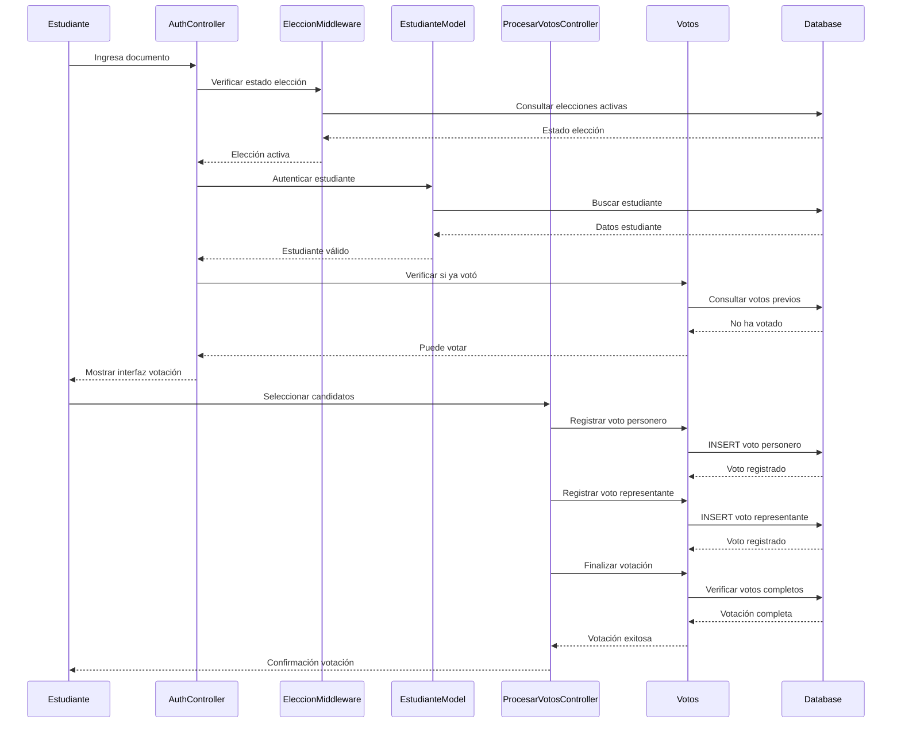
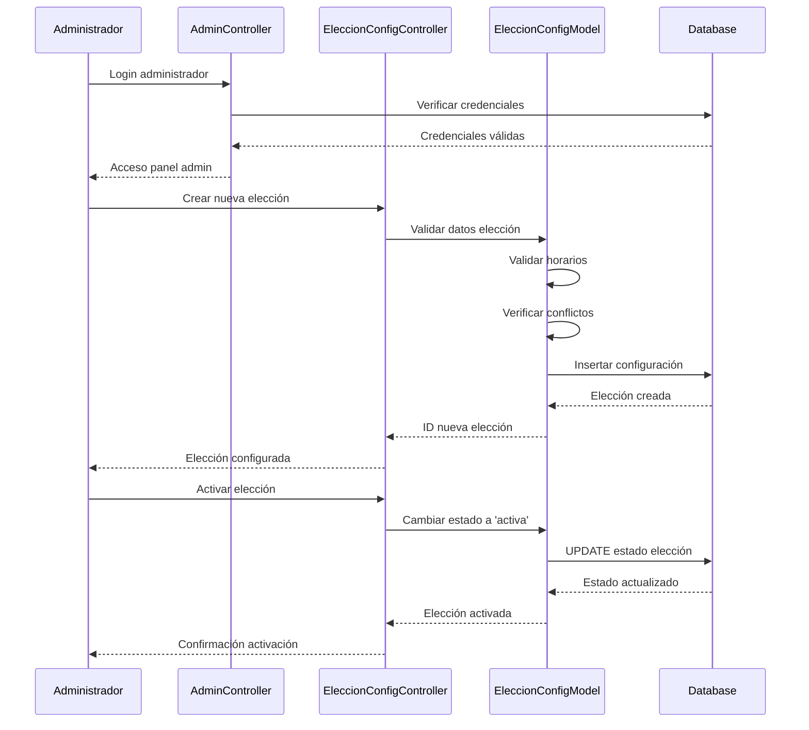

# ANÁLISIS DE SISTEMA - DIAGRAMAS UML
## Sistema de Votación Electrónica Escolar

---

## ÍNDICE
1. [Análisis de Actores](#análisis-de-actores)
2. [Casos de Uso por Épicas](#casos-de-uso-por-épicas)
3. [Diagramas de Casos de Uso](#diagramas-de-casos-de-uso)
4. [Historias de Usuario](#historias-de-usuario)
5. [Diagrama de Clases](#diagrama-de-clases)
6. [Diagrama de Base de Datos](#diagrama-de-base-de-datos)

---

## ANÁLISIS DE ACTORES

### Actores Principales Identificados:

1. **Estudiante** - Usuario votante principal
2. **Docente** - Usuario votante para representante docente
3. **Administrativo** - Personal administrativo que vota por representante docente
4. **Administrador** - Gestor del sistema electoral
5. **Sistema** - Actor del sistema para procesos automáticos

### Características de los Actores:

| Actor | Descripción | Permisos | Restricciones |
|-------|-------------|----------|---------------|
| **Estudiante** | Estudiante de grados 6-11 | Votar por personero y representante de grado | Solo puede votar una vez, debe estar activo |
| **Docente** | Personal docente activo | Votar por representante docente | Solo puede votar una vez, debe estar activo |
| **Administrativo** | Personal administrativo | Votar por representante docente | Solo puede votar una vez, debe estar activo |
| **Administrador** | Administrador del sistema | Gestión completa del sistema | Acceso total a configuración y datos |
| **Sistema** | Procesos automáticos | Activar/cerrar elecciones, generar reportes | Basado en configuración temporal |

---

## CASOS DE USO POR ÉPICAS

### ÉPICA 1: GESTIÓN DE AUTENTICACIÓN Y ACCESO

#### Historia de Usuario:
*Como usuario del sistema, quiero poder autenticarme de forma segura para acceder a las funcionalidades correspondientes a mi rol.*

#### Casos de Uso:
- **CU-001**: Autenticar Estudiante
- **CU-002**: Autenticar Docente/Administrativo
- **CU-003**: Autenticar Administrador
- **CU-004**: Cerrar Sesión
- **CU-005**: Verificar Estado de Elección

### ÉPICA 2: GESTIÓN DE VOTACIÓN

#### Historia de Usuario:
*Como votante, quiero poder ejercer mi voto de forma intuitiva y segura durante el período electoral.*

#### Casos de Uso:
- **CU-006**: Votar por Personero (Estudiantes)
- **CU-007**: Votar por Representante de Grado (Estudiantes)
- **CU-008**: Votar por Representante Docente (Docentes/Administrativos)
- **CU-009**: Votar en Blanco
- **CU-010**: Finalizar Votación
- **CU-011**: Cancelar Votación

### ÉPICA 3: ADMINISTRACIÓN DE ELECCIONES

#### Historia de Usuario:
*Como administrador, quiero gestionar completamente el proceso electoral desde la configuración hasta los resultados.*

#### Casos de Uso:
- **CU-012**: Crear Nueva Elección
- **CU-013**: Configurar Elección
- **CU-014**: Activar Elección
- **CU-015**: Cerrar Elección
- **CU-016**: Cancelar Elección
- **CU-017**: Consultar Estado de Elecciones

### ÉPICA 4: GESTIÓN DE CANDIDATOS

#### Historia de Usuario:
*Como administrador, quiero gestionar los candidatos para garantizar que la información esté completa y actualizada.*

#### Casos de Uso:
- **CU-018**: Registrar Candidato
- **CU-019**: Editar Candidato
- **CU-020**: Eliminar Candidato
- **CU-021**: Consultar Candidatos
- **CU-022**: Subir Foto de Candidato

### ÉPICA 5: GESTIÓN DE USUARIOS

#### Historia de Usuario:
*Como administrador, quiero gestionar los usuarios del sistema para mantener la base de datos actualizada.*

#### Casos de Uso:
- **CU-023**: Gestionar Estudiantes
- **CU-024**: Gestionar Docentes
- **CU-025**: Gestionar Administrativos
- **CU-026**: Consultar Usuarios

### ÉPICA 6: REPORTES Y ESTADÍSTICAS

#### Historia de Usuario:
*Como administrador, quiero acceder a reportes y estadísticas para monitorear el proceso electoral.*

#### Casos de Uso:
- **CU-027**: Generar Estadísticas en Tiempo Real
- **CU-028**: Consultar Resultados
- **CU-029**: Generar Reportes
- **CU-030**: Consultar Logs de Acceso

---

## DIAGRAMAS DE CASOS DE USO

### Diagrama General del Sistema

```mermaid
graph TB
    %% Actores
    EST[👤 Estudiante]
    DOC[👨‍🏫 Docente]
    ADM_USER[👨‍💼 Administrativo]
    ADMIN[👨‍💻 Administrador]
    SYS[🤖 Sistema]

    %% Casos de Uso - Autenticación
    subgraph "AUTENTICACIÓN Y ACCESO"
        CU001[CU-001: Autenticar Estudiante]
        CU002[CU-002: Autenticar Docente/Administrativo]
        CU003[CU-003: Autenticar Administrador]
        CU004[CU-004: Cerrar Sesión]
        CU005[CU-005: Verificar Estado Elección]
    end

    %% Casos de Uso - Votación
    subgraph "GESTIÓN DE VOTACIÓN"
        CU006[CU-006: Votar por Personero]
        CU007[CU-007: Votar por Representante Grado]
        CU008[CU-008: Votar por Representante Docente]
        CU009[CU-009: Votar en Blanco]
        CU010[CU-010: Finalizar Votación]
        CU011[CU-011: Cancelar Votación]
    end

    %% Casos de Uso - Administración
    subgraph "ADMINISTRACIÓN DE ELECCIONES"
        CU012[CU-012: Crear Nueva Elección]
        CU013[CU-013: Configurar Elección]
        CU014[CU-014: Activar Elección]
        CU015[CU-015: Cerrar Elección]
        CU016[CU-016: Cancelar Elección]
        CU017[CU-017: Consultar Estado Elecciones]
    end

    %% Casos de Uso - Candidatos
    subgraph "GESTIÓN DE CANDIDATOS"
        CU018[CU-018: Registrar Candidato]
        CU019[CU-019: Editar Candidato]
        CU020[CU-020: Eliminar Candidato]
        CU021[CU-021: Consultar Candidatos]
        CU022[CU-022: Subir Foto Candidato]
    end

    %% Casos de Uso - Usuarios
    subgraph "GESTIÓN DE USUARIOS"
        CU023[CU-023: Gestionar Estudiantes]
        CU024[CU-024: Gestionar Docentes]
        CU025[CU-025: Gestionar Administrativos]
        CU026[CU-026: Consultar Usuarios]
    end

    %% Casos de Uso - Reportes
    subgraph "REPORTES Y ESTADÍSTICAS"
        CU027[CU-027: Generar Estadísticas]
        CU028[CU-028: Consultar Resultados]
        CU029[CU-029: Generar Reportes]
        CU030[CU-030: Consultar Logs]
    end

    %% Relaciones Estudiante
    EST --> CU001
    EST --> CU006
    EST --> CU007
    EST --> CU009
    EST --> CU010
    EST --> CU011
    EST --> CU004

    %% Relaciones Docente/Administrativo
    DOC --> CU002
    DOC --> CU008
    DOC --> CU009
    DOC --> CU010
    DOC --> CU004
    ADM_USER --> CU002
    ADM_USER --> CU008
    ADM_USER --> CU009
    ADM_USER --> CU010
    ADM_USER --> CU004

    %% Relaciones Administrador
    ADMIN --> CU003
    ADMIN --> CU012
    ADMIN --> CU013
    ADMIN --> CU014
    ADMIN --> CU015
    ADMIN --> CU016
    ADMIN --> CU017
    ADMIN --> CU018
    ADMIN --> CU019
    ADMIN --> CU020
    ADMIN --> CU021
    ADMIN --> CU022
    ADMIN --> CU023
    ADMIN --> CU024
    ADMIN --> CU025
    ADMIN --> CU026
    ADMIN --> CU027
    ADMIN --> CU028
    ADMIN --> CU029
    ADMIN --> CU030
    ADMIN --> CU004

    %% Relaciones Sistema
    SYS --> CU005
    SYS --> CU014
    SYS --> CU015
    SYS --> CU027

    %% Includes y Extends
    CU006 -.->|includes| CU005
    CU007 -.->|includes| CU005
    CU008 -.->|includes| CU005
    CU010 -.->|includes| CU009
```



### Diagrama Detallado - Épica de Votación



---

## HISTORIAS DE USUARIO DETALLADAS

### ÉPICA 1: AUTENTICACIÓN Y ACCESO

#### HU-001: Autenticación de Estudiante
**Como** estudiante del colegio  
**Quiero** poder ingresar con mi número de documento  
**Para** acceder al sistema de votación y ejercer mi derecho al voto  

**Criterios de Aceptación:**
- El sistema debe validar que el documento sea numérico
- El estudiante debe estar registrado y activo en el sistema
- El sistema debe verificar que hay elecciones activas
- El sistema debe verificar que el estudiante no haya votado previamente
- Debe mostrar mensajes de error claros en caso de fallo

#### HU-002: Verificación de Estado Electoral
**Como** usuario del sistema  
**Quiero** que se verifique automáticamente el estado de las elecciones  
**Para** asegurarme de que solo puedo votar durante el período electoral activo  

**Criterios de Aceptación:**
- El sistema debe verificar fechas y horarios de votación
- Debe mostrar información clara sobre el estado actual
- Debe bloquear el acceso fuera del horario electoral
- Debe registrar intentos de acceso para auditoría

### ÉPICA 2: GESTIÓN DE VOTACIÓN

#### HU-003: Votación por Personero
**Como** estudiante  
**Quiero** poder votar por el candidato a personero de mi preferencia  
**Para** elegir quien me represente en el gobierno estudiantil  

**Criterios de Aceptación:**
- Debe mostrar todos los candidatos a personero con sus fotos y propuestas
- Debe permitir seleccionar solo un candidato
- Debe incluir opción de voto en blanco
- Debe confirmar la selección antes de registrar el voto
- El voto debe quedar registrado de forma anónima

#### HU-004: Votación por Representante de Grado
**Como** estudiante  
**Quiero** poder votar por el representante de mi grado  
**Para** elegir quien represente los intereses de mi curso  

**Criterios de Aceptación:**
- Debe mostrar solo candidatos del grado correspondiente al estudiante
- Debe validar que el estudiante pertenece al grado
- Debe permitir voto en blanco
- El sistema debe asociar correctamente el voto con el grado

#### HU-005: Votación Docente/Administrativo
**Como** docente o administrativo  
**Quiero** poder votar por el representante docente  
**Para** elegir quien represente mis intereses en el consejo directivo  

**Criterios de Aceptación:**
- Debe autenticar con cédula o código de empleado
- Debe mostrar todos los candidatos a representante docente
- Debe permitir voto en blanco
- Debe diferenciar entre docentes y administrativos en los registros

### ÉPICA 3: ADMINISTRACIÓN DE ELECCIONES

#### HU-006: Configuración de Nueva Elección
**Como** administrador  
**Quiero** poder crear y configurar una nueva elección  
**Para** establecer los parámetros del proceso electoral  

**Criterios de Aceptación:**
- Debe permitir establecer nombre y descripción de la elección
- Debe configurar fechas y horarios de inicio y cierre
- Debe seleccionar tipos de votación (estudiantes, docentes, administrativos)
- Debe validar que no haya conflictos de horarios
- Debe permitir configuraciones adicionales específicas

#### HU-007: Gestión de Estados de Elección
**Como** administrador  
**Quiero** poder cambiar el estado de las elecciones  
**Para** controlar el flujo del proceso electoral  

**Criterios de Aceptación:**
- Estados disponibles: programada, activa, cerrada, cancelada
- Debe validar transiciones de estado válidas
- Debe registrar cambios para auditoría
- Debe notificar cambios a los usuarios del sistema

### ÉPICA 4: GESTIÓN DE CANDIDATOS

#### HU-008: Registro de Candidatos
**Como** administrador  
**Quiero** poder registrar candidatos para las diferentes posiciones  
**Para** que los votantes tengan opciones disponibles  

**Criterios de Aceptación:**
- Debe permitir registro de personeros y representantes
- Debe validar datos obligatorios (nombre, número de tarjetón)
- Debe permitir subir foto del candidato
- Debe validar que no haya números de tarjetón duplicados
- Para representantes debe especificar el grado

#### HU-009: Gestión de Fotos de Candidatos
**Como** administrador  
**Quiero** poder subir y gestionar fotos de candidatos  
**Para** que los votantes puedan identificar visualmente a los candidatos  

**Criterios de Aceptación:**
- Debe aceptar formatos de imagen estándar (JPG, PNG)
- Debe redimensionar automáticamente las imágenes
- Debe tener imagen por defecto para candidatos sin foto
- Debe permitir actualizar fotos existentes

### ÉPICA 5: REPORTES Y ESTADÍSTICAS

#### HU-010: Dashboard de Estadísticas
**Como** administrador  
**Quiero** ver estadísticas en tiempo real del proceso electoral  
**Para** monitorear el progreso y participación  

**Criterios de Aceptación:**
- Debe mostrar total de votos emitidos
- Debe mostrar porcentaje de participación
- Debe mostrar estadísticas por tipo de usuario
- Debe actualizar automáticamente
- Debe mostrar votos recientes (sin revelar identidad)

#### HU-011: Consulta de Resultados
**Como** administrador  
**Quiero** poder consultar los resultados de las elecciones  
**Para** conocer los ganadores y estadísticas finales  

**Criterios de Aceptación:**
- Solo disponible cuando la elección esté cerrada
- Debe mostrar resultados por categoría (personero, representantes)
- Debe incluir votos en blanco
- Debe mostrar porcentajes y gráficos
- Debe permitir exportar resultados

---

## DIAGRAMA DE CLASES

```mermaid
classDiagram
    %% Clases de Controladores
    class AuthController {
        -EstudianteModel estudianteModel
        +login()
        +logout()
    }

    class AdminController {
        -Admin adminModel
        +login()
        +autenticar()
        +panel()
        +cerrarSesion()
    }

    class DocenteController {
        -DocenteModel docenteModel
        -AdministrativoModel administrativoModel
        +login()
        +autenticar()
        +panel()
        +cerrarSesion()
    }

    class AdminCandidatosController {
        -Candidatos candidatosModel
        +index()
        +agregarCandidato()
        +editarCandidato()
        +eliminarCandidato()
        +validarNumero()
        -procesarFoto()
    }

    class ProcesarVotosController {
        -Votos votosModel
        +procesarVoto()
        +procesarVotoEnBlanco()
        +finalizarVotacion()
        +cancelarVotacion()
    }

    class EleccionConfigController {
        -EleccionConfigModel eleccionModel
        +crearEleccion()
        +editarEleccion()
        +activarEleccion()
        +cerrarEleccion()
        +cancelarEleccion()
    }

    %% Clases de Modelos
    class EstudianteModel {
        -Database conn
        +getAllEstudiantes()
        +autenticarEstudiante(id)
        +haVotado(id)
        +crearEstudiante(datos)
        +actualizarEstudiante(id, datos)
        +eliminarEstudiante(id)
    }

    class DocenteModel {
        -Database conn
        +getDocentePorDocumento(documento)
        +getAllDocentes()
        +crearDocente(datos)
        +actualizarDocente(codigo, datos)
        +eliminarDocente(codigo)
    }

    class AdministrativoModel {
        -Database conn
        +getAdministrativoPorCedula(cedula)
        +getAllAdministrativos()
        +crearAdministrativo(datos)
        +actualizarAdministrativo(codigo, datos)
        +eliminarAdministrativo(codigo)
    }

    class Admin {
        -Database conn
        +authenticate(usuario, password)
        +getAllAdmins()
        +getById(id)
        +updateProfileImage(id, imageUrl)
    }

    class Candidatos {
        -Database conn
        +obtenerCandidatos(offset, limit, busqueda, tipo)
        +obtenerPorId(id)
        +crear(datos)
        +actualizar(id, datos)
        +eliminar(id)
        +obtenerPorTipo(tipo, grado)
        +existeNumero(numero, tipo, grado)
        -validarDatos(datos)
    }

    class Votos {
        -Database conn
        +haVotadoPorTipo(id_estudiante, tipo)
        +registrarVoto(id_estudiante, id_candidato, tipo)
        +registrarVotoEnBlanco(id_estudiante, tipo)
        +finalizarVotacion(id_estudiante)
        +getConteoVotosPorTipo(tipo)
        +haVotadoDocente(id_docente)
        +registrarVotoDocente(id_docente, id_representante, voto_blanco)
        +getEstadisticasVotacionDocentes()
    }

    class EleccionConfigModel {
        -Database conn
        +getConfiguracionActiva()
        +crearConfiguracion(datos)
        +actualizarConfiguracion(id, datos)
        +cambiarEstadoEleccion(id, estado)
        +verificarEleccionesActivas()
        +validarHorarios(fechaInicio, fechaCierre)
        +verificarConflictosHorarios(fechaInicio, fechaCierre)
    }

    class Estadisticas {
        -Database conn
        +getTotalEstudiantes()
        +getTotalVotos()
        +getTotalCandidatos()
        +getPorcentajeParticipacion()
        +getVotosRecientes(limit)
    }

    class RepresentanteDocenteModel {
        -Database conn
        +getAll()
        +getByCodigo(codigo)
    }

    %% Clases de Utilidades
    class SessionManager {
        +iniciarSesion()
        +establecerSesionEstudiante(estudiante)
        +establecerSesionAdmin(admin)
        +establecerSesionDocente(docente)
        +esEstudianteAutenticado()
        +esAdminAutenticado()
        +esDocenteAutenticado()
        +cerrarSesionEstudiante()
        +cerrarSesionAdmin()
        +cerrarSesionDocente()
    }

    class EleccionMiddleware {
        +verificarAccesoVotante(tipoUsuario)
        +verificarEleccionesActivas()
        +verificarHorarioVotacion()
        +registrarIntentoAcceso(datos)
        +registrarAccesoExitoso(datos)
        +puedeVotar(tipoUsuario, idUsuario)
        +yaVoto(tipoUsuario, idUsuario)
    }

    class CandidatoImageHelper {
        +obtenerImagenCandidato(foto, cache_busting)
        +generarImagenHTML(candidato, width, height, class)
        +tieneFotoPersonalizada(foto)
    }

    class Database {
        -mysqli connection
        +getConnection()
        +closeConnection()
    }

    %% Relaciones entre Controladores y Modelos
    AuthController --> EstudianteModel
    AdminController --> Admin
    AdminController --> Estadisticas
    DocenteController --> DocenteModel
    DocenteController --> AdministrativoModel
    AdminCandidatosController --> Candidatos
    ProcesarVotosController --> Votos
    EleccionConfigController --> EleccionConfigModel

    %% Relaciones de Modelos con Database
    EstudianteModel --> Database
    DocenteModel --> Database
    AdministrativoModel --> Database
    Admin --> Database
    Candidatos --> Database
    Votos --> Database
    EleccionConfigModel --> Database
    Estadisticas --> Database
    RepresentanteDocenteModel --> Database

    %% Relaciones de uso de Utilidades
    AuthController --> SessionManager
    AuthController --> EleccionMiddleware
    AdminController --> SessionManager
    DocenteController --> EleccionMiddleware
    AdminCandidatosController --> CandidatoImageHelper
    ProcesarVotosController --> SessionManager

    %% Relaciones de herencia/composición
    Votos --> EstudianteModel : uses
    Votos --> DocenteModel : uses
    Votos --> AdministrativoModel : uses
    Estadisticas -->
    Estadisticas --> Votos : uses
    Estadisticas --> EstudianteModel : uses
    Estadisticas --> Candidatos : uses
```

---

## DIAGRAMA DE BASE DE DATOS



---

## ARQUITECTURA DEL SISTEMA

### Patrón Arquitectónico: MVC (Model-View-Controller)



---

## FLUJO DE PROCESOS PRINCIPALES

### Proceso de Votación de Estudiantes



### Proceso de Configuración de Elecciones



---

## PATRONES DE DISEÑO IMPLEMENTADOS

### 1. **Singleton Pattern**
- **Clase**: `Database`
- **Propósito**: Garantizar una única instancia de conexión a la base de datos
- **Implementación**: Control de instancia única para optimizar recursos

### 2. **Factory Pattern**
- **Clase**: `SessionManager`
- **Propósito**: Crear y gestionar diferentes tipos de sesiones (estudiante, docente, admin)
- **Implementación**: Métodos estáticos para crear sesiones específicas

### 3. **Strategy Pattern**
- **Clase**: `EleccionMiddleware`
- **Propósito**: Diferentes estrategias de validación según el tipo de usuario
- **Implementación**: Métodos específicos para cada tipo de votante

### 4. **Observer Pattern**
- **Clase**: `LogsAccesoModel`
- **Propósito**: Registrar eventos del sistema automáticamente
- **Implementación**: Registro automático de accesos y votaciones

### 5. **Template Method Pattern**
- **Clases**: Controladores de administración
- **Propósito**: Estructura común para operaciones CRUD
- **Implementación**: Métodos base para crear, leer, actualizar, eliminar

---

## CONSIDERACIONES DE SEGURIDAD

### Autenticación y Autorización
- **Validación de entrada**: Sanitización de todos los datos de entrada
- **Control de sesiones**: Gestión segura de sesiones con timeouts
- **Verificación de permisos**: Middleware para verificar acceso por rol
- **Prevención de ataques**: Protección contra SQL injection y XSS

### Integridad de Datos
- **Transacciones**: Uso de transacciones para operaciones críticas
- **Validaciones**: Múltiples niveles de validación de datos
- **Auditoría**: Registro completo de todas las acciones del sistema
- **Respaldos**: Estrategia de respaldo automático de datos

### Privacidad del Voto
- **Anonimización**: Los votos no se asocian directamente con identidades
- **Separación de datos**: Información de votantes separada de votos
- **Encriptación**: Datos sensibles encriptados en tránsito y reposo
- **Acceso restringido**: Solo administradores pueden acceder a resultados

---

## MÉTRICAS Y MONITOREO

### Indicadores Clave de Rendimiento (KPIs)
- **Participación electoral**: Porcentaje de votantes que ejercieron su derecho
- **Tiempo de respuesta**: Velocidad de procesamiento de votos
- **Disponibilidad del sistema**: Uptime durante período electoral
- **Errores de sistema**: Tasa de errores y fallos

### Monitoreo en Tiempo Real
- **Dashboard administrativo**: Estadísticas en vivo del proceso
- **Alertas automáticas**: Notificaciones de eventos críticos
- **Logs de auditoría**: Registro detallado de todas las operaciones
- **Métricas de uso**: Análisis de patrones de acceso y uso

---

## CONCLUSIONES

Este análisis presenta un sistema de votación electrónica robusto y bien estructurado que implementa:

1. **Arquitectura MVC clara** con separación de responsabilidades
2. **Múltiples tipos de usuarios** con diferentes niveles de acceso
3. **Proceso electoral completo** desde configuración hasta resultados
4. **Seguridad integral** con múltiples capas de protección
5. **Escalabilidad** para manejar diferentes tipos de elecciones
6. **Auditoría completa** con trazabilidad de todas las operaciones

El sistema está diseñado para garantizar la integridad, seguridad y transparencia del proceso electoral, cumpliendo con los requisitos de un entorno educativo y proporcionando una base sólida para futuras mejoras y expansiones.

### Recomendaciones para Mejoras Futuras:

1. **Implementar autenticación de dos factores** para administradores
2. **Agregar notificaciones en tiempo real** para eventos críticos
3. **Desarrollar API REST** para integración con otros sistemas
4. **Implementar sistema de respaldos automáticos** más robusto
5. **Agregar funcionalidad de exportación** de datos en múltiples formatos
6. **Desarrollar aplicación móvil** para facilitar el acceso
7. **Implementar sistema de encuestas** post-electorales
8. **Agregar funcionalidad de múltiples idiomas** para inclusión

---

**Documento generado por:** Análisis de Sistema  
**Fecha:** 2025-01-09  
**Versión:** 1.0  
**Estado:** Completo