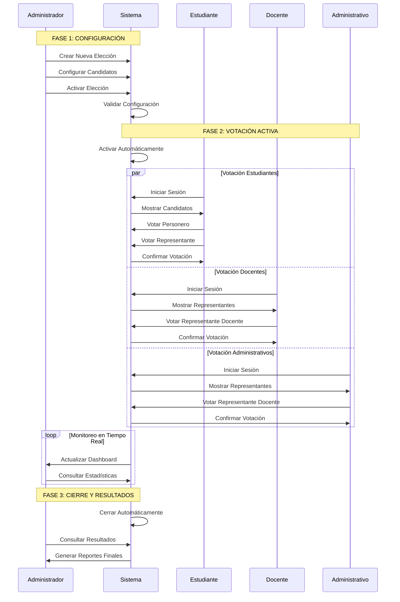

    classDef security fill:#ffebee,stroke:#d32f2f,stroke-width:2px
    classDef audit fill:#f3e5f5,stroke:#7b1fa2,stroke-width:2px
    classDef maintenance fill:#e8f5e8,stroke:#388e3c,stroke-width:2px
    
    class SYS actor
    class CU_SYS_001,CU_SYS_002,CU_SYS_003,CU_SYS_004,CU_SYS_005 election
    class CU_SYS_006,CU_SYS_007,CU_SYS_008,CU_SYS_009,CU_SYS_010 security
    class CU_SYS_011,CU_SYS_012,CU_SYS_013,CU_SYS_014,CU_SYS_015 audit
    class CU_SYS_016,CU_SYS_017,CU_SYS_018,CU_SYS_019,CU_SYS_020 maintenance
```

---

## CASOS DE USO COMPARTIDOS

### Casos de Uso Transversales entre Actores

```mermaid
graph TB
    %% Actores
    EST[👤 Estudiante]
    DOC[👨‍🏫 Docente]
    ADM_USER[👨‍💼 Administrativo]
    ADMIN[👨‍💻 Administrador]
    
    %% Casos de Uso Compartidos
    subgraph "CASOS DE USO COMPARTIDOS"
        CU_SHARED_001[CU-SHARED-001<br/>Verificar Estado<br/>Sistema Electoral]
        CU_SHARED_002[CU-SHARED-002<br/>Consultar Horarios<br/>de Votación]
        CU_SHARED_003[CU-SHARED-003<br/>Ver Información<br/>General Elección]
        CU_SHARED_004[CU-SHARED-004<br/>Cerrar Sesión<br/>Usuario]
        CU_SHARED_005[CU-SHARED-005<br/>Cambiar Idioma<br/>Interfaz]
    end
    
    %% Casos de Uso Específicos por Grupo
    subgraph "VOTANTES (Estudiantes, Docentes, Administrativos)"
        CU_VOTER_001[CU-VOTER-001<br/>Verificar Elegibilidad<br/>para Votar]
        CU_VOTER_002[CU-VOTER-002<br/>Ver Estado Personal<br/>de Votación]
        CU_VOTER_003[CU-VOTER-003<br/>Recibir Confirmación<br/>Voto Exitoso]
    end
    
    %% Casos de Uso de Personal (Docentes y Administrativos)
    subgraph "PERSONAL INSTITUCIONAL"
        CU_STAFF_001[CU-STAFF-001<br/>Votar por Representante<br/>Docente]
        CU_STAFF_002[CU-STAFF-002<br/>Consultar Candidatos<br/>Representante Docente]
        CU_STAFF_003[CU-STAFF-003<br/>Ver Propuestas<br/>Representantes]
    end
    
    %% Relaciones compartidas
    EST --> CU_SHARED_001
    DOC --> CU_SHARED_001
    ADM_USER --> CU_SHARED_001
    ADMIN --> CU_SHARED_001
    
    EST --> CU_SHARED_004
    DOC --> CU_SHARED_004
    ADM_USER --> CU_SHARED_004
    ADMIN --> CU_SHARED_004
    
    %% Relaciones de votantes
    EST --> CU_VOTER_001
    DOC --> CU_VOTER_001
    ADM_USER --> CU_VOTER_001
    
    %% Relaciones de personal
    DOC --> CU_STAFF_001
    ADM_USER --> CU_STAFF_001
    
    %% Estilos
    classDef actor fill:#e1f5fe,stroke:#0277bd,stroke-width:2px
    classDef shared fill:#f3e5f5,stroke:#7b1fa2,stroke-width:2px
    classDef voter fill:#e8f5e8,stroke:#388e3c,stroke-width:2px
    classDef staff fill:#fff3e0,stroke:#f57c00,stroke-width:2px
    
    class EST,DOC,ADM_USER,ADMIN actor
    class CU_SHARED_001,CU_SHARED_002,CU_SHARED_003,CU_SHARED_004,CU_SHARED_005 shared
    class CU_VOTER_001,CU_VOTER_002,CU_VOTER_003 voter
    class CU_STAFF_001,CU_STAFF_002,CU_STAFF_003 staff
```



---

## MATRIZ DE TRAZABILIDAD

### Matriz Actor vs Casos de Uso

| **CASO DE USO** | **ESTUDIANTE** | **DOCENTE** | **ADMINISTRATIVO** | **ADMINISTRADOR** | **SISTEMA** |
|-----------------|:--------------:|:-----------:|:------------------:|:-----------------:|:-----------:|
| **AUTENTICACIÓN** |
| Iniciar Sesión | ✅ | ✅ | ✅ | ✅ | - |
| Verificar Credenciales | ✅ | ✅ | ✅ | ✅ | ✅ |
| Cerrar Sesión | ✅ | ✅ | ✅ | ✅ | - |
| **VOTACIÓN** |
| Votar Personero | ✅ | - | - | - | - |
| Votar Representante Grado | ✅ | - | - | - | - |
| Votar Representante Docente | - | ✅ | ✅ | - | - |
| Votar en Blanco | ✅ | ✅ | ✅ | - | - |
| Confirmar Votación | ✅ | ✅ | ✅ | - | - |
| **GESTIÓN CANDIDATOS** |
| Crear Candidato | - | - | - | ✅ | - |
| Editar Candidato | - | - | - | ✅ | - |
| Eliminar Candidato | - | - | - | ✅ | - |
| Subir Foto Candidato | - | - | - | ✅ | - |
| **GESTIÓN ELECCIONES** |
| Crear Elección | - | - | - | ✅ | - |
| Activar Elección | - | - | - | ✅ | ✅ |
| Cerrar Elección | - | - | - | ✅ | ✅ |
| Cancelar Elección | - | - | - | ✅ | - |
| **GESTIÓN USUARIOS** |
| Gestionar Estudiantes | - | - | - | ✅ | - |
| Gestionar Docentes | - | - | - | ✅ | - |
| Gestionar Administrativos | - | - | - | ✅ | - |
| **REPORTES** |
| Ver Dashboard | - | - | - | ✅ | - |
| Generar Reportes | - | - | - | ✅ | ✅ |
| Consultar Resultados | - | - | - | ✅ | - |
| Consultar Logs | - | - | - | ✅ | ✅ |
| **SISTEMA** |
| Validar Horarios | - | - | - | - | ✅ |
| Monitorear Sistema | - | - | - | - | ✅ |
| Realizar Respaldos | - | - | - | - | ✅ |
| Generar Alertas | - | - | - | - | ✅ |

### Estadísticas de Casos de Uso por Actor

| **ACTOR** | **CASOS DE USO PRINCIPALES** | **CASOS DE USO SECUNDARIOS** | **TOTAL** |
|-----------|:-----------------------------:|:-----------------------------:|:---------:|
| **Estudiante** | 14 | 8 | **22** |
| **Docente** | 12 | 6 | **18** |
| **Administrativo** | 12 | 6 | **18** |
| **Administrador** | 31 | 12 | **43** |
| **Sistema** | 20 | 8 | **28** |
| **TOTAL ÚNICO** | **89** | **40** | **129** |

---

## ESPECIFICACIONES DETALLADAS POR ACTOR

### ESTUDIANTE - Especificaciones Detalladas

#### CU-EST-005: Ver Candidatos a Personero
- **ID**: CU-EST-005
- **Nombre**: Ver Candidatos a Personero
- **Actor Principal**: Estudiante
- **Precondiciones**: 
  - Estudiante autenticado
  - Elección activa
  - Estudiante no ha votado
- **Flujo Principal**:
  1. Sistema muestra lista de candidatos a personero
  2. Sistema muestra foto de cada candidato
  3. Sistema muestra número de tarjetón
  4. Sistema muestra propuesta de cada candidato
  5. Sistema habilita opciones de selección
- **Postcondiciones**: Candidatos mostrados correctamente
- **Excepciones**: 
  - No hay candidatos registrados
  - Error al cargar imágenes
- **Frecuencia de Uso**: Alta (durante período electoral)
- **Importancia**: Crítica

#### CU-EST-012: Confirmar Votación Completa
- **ID**: CU-EST-012
- **Nombre**: Confirmar Votación Completa
- **Actor Principal**: Estudiante
- **Precondiciones**: 
  - Selecciones realizadas para personero y representante
  - Revisión completada
- **Flujo Principal**:
  1. Sistema valida que ambos votos estén seleccionados
  2. Sistema muestra resumen de selecciones
  3. Estudiante confirma votación final
  4. Sistema registra votos en base de datos
  5. Sistema invalida sesión para prevenir doble votación
  6. Sistema muestra confirmación exitosa
- **Postcondiciones**: 
  - Votos registrados permanentemente
  - Estudiante marcado como "ya votó"
  - Sesión cerrada automáticamente
- **Excepciones**: 
  - Error en base de datos
  - Pérdida de conexión
  - Votación incompleta
- **Frecuencia de Uso**: Una vez por estudiante por elección
- **Importancia**: Crítica

### ADMINISTRADOR - Especificaciones Detalladas

#### CU-ADMIN-005: Crear Nueva Elección
- **ID**: CU-ADMIN-005
- **Nombre**: Crear Nueva Elección
- **Actor Principal**: Administrador
- **Precondiciones**: 
  - Administrador autenticado
  - No hay elecciones activas conflictivas
- **Flujo Principal**:
  1. Administrador accede al formulario de nueva elección
  2. Ingresa nombre y descripción de la elección
  3. Configura fechas de inicio y cierre
  4. Selecciona tipos de votación habilitados
  5. Configura parámetros adicionales
  6. Sistema valida no conflictos de horario
  7. Sistema crea registro de elección
  8. Sistema asigna ID único a la elección
- **Postcondiciones**: 
  - Nueva elección creada en estado "programada"
  - Configuración guardada en base de datos
- **Excepciones**: 
  - Conflicto de horarios
  - Datos inválidos
  - Error de base de datos
- **Frecuencia de Uso**: Baja (pocas veces al año)
- **Importancia**: Crítica

#### CU-ADMIN-022: Ver Dashboard Tiempo Real
- **ID**: CU-ADMIN-022
- **Nombre**: Ver Dashboard Tiempo Real
- **Actor Principal**: Administrador
- **Precondiciones**: 
  - Administrador autenticado
  - Elección activa o datos históricos disponibles
- **Flujo Principal**:
  1. Sistema carga estadísticas actuales
  2. Muestra total de votos emitidos
  3. Muestra porcentaje de participación por tipo de usuario
  4. Muestra gráficos de participación en tiempo real
  5. Muestra actividad reciente (sin identificar votantes)
  6. Actualiza datos automáticamente cada 30 segundos
- **Postcondiciones**: Dashboard actualizado y funcional
- **Excepciones**: 
  - Error al cargar estadísticas
  - Problemas de conectividad
- **Frecuencia de Uso**: Alta (durante elecciones)
- **Importancia**: Alta

---

## DIAGRAMAS DE INTERACCIÓN ENTRE ACTORES

### Flujo de Interacción: Proceso Electoral Completo



---

## PATRONES DE CASOS DE USO IDENTIFICADOS

### 1. Patrón de Autenticación
**Actores**: Todos los actores humanos
**Estructura Común**:
- Iniciar Sesión
- Verificar Credenciales
- Establecer Sesión
- Cerrar Sesión

### 2. Patrón de Votación
**Actores**: Estudiante, Docente, Administrativo
**Estructura Común**:
- Verificar Elegibilidad
- Mostrar Opciones de Voto
- Seleccionar Candidato/Voto en Blanco
- Confirmar Selección
- Registrar Voto

### 3. Patrón CRUD Administrativo
**Actor**: Administrador
**Estructura Común**:
- Crear Entidad
- Leer/Consultar Entidad
- Actualizar Entidad
- Eliminar Entidad

### 4. Patrón de Validación Automática
**Actor**: Sistema
**Estructura Común**:
- Verificar Condiciones
- Ejecutar Acción Automática
- Registrar Evento
- Notificar Resultado

---

## CONCLUSIONES Y RECOMENDACIONES

### Análisis de Complejidad por Actor

1. **Administrador** (43 casos de uso)
   - Mayor complejidad funcional
   - Requiere interfaz más robusta
   - Necesita capacitación especializada

2. **Sistema** (28 casos de uso)
   - Alta complejidad técnica
   - Requiere monitoreo continuo
   - Crítico para la estabilidad

3. **Estudiante** (22 casos de uso)
   - Interfaz debe ser muy intuitiva
   - Proceso guiado paso a paso
   - Validaciones exhaustivas

4. **Docente/Administrativo** (18 casos de uso cada uno)
   - Procesos similares pero diferenciados
   - Interfaz compartida con personalización
   - Validaciones específicas por tipo

### Recomendaciones de Implementación

1. **Prioridad de Desarrollo**:
   - Fase 1: Casos de uso críticos de votación
   - Fase 2: Gestión administrativa básica
   - Fase 3: Reportes y estadísticas avanzadas
   - Fase 4: Automatización del sistema

2. **Consideraciones de UX/UI**:
   - Interfaces diferenciadas por actor
   - Flujos guiados para votantes
   - Dashboard ejecutivo para administrador
   - Responsive design para todos los actores

3. **Seguridad por Actor**:
   - Estudiantes: Validación de identidad simple
   - Personal: Autenticación reforzada
   - Administrador: Autenticación de dos factores
   - Sistema: Logs de auditoría completos

---

**Documento generado por:** Analista de Sistemas  
**Fecha:** 2025-01-09  
**Versión:** 1.0  
**Estado:** Completo - Diagramas Detallados por Actor