| CU-ADMIN-019 | Importar Datos Masivos | Importación masiva de usuarios | 🟡 Media |
| CU-ADMIN-020 | Exportar Listados Usuarios | Exportar datos de usuarios | 🟡 Media |
| **REPORTES Y ESTADÍSTICAS** |
| CU-ADMIN-021 | Ver Dashboard Tiempo Real | Dashboard con estadísticas en vivo | 🔴 Alta |
| CU-ADMIN-022 | Generar Reportes Participación | Reportes de participación electoral | 🔴 Alta |
| CU-ADMIN-023 | Consultar Resultados Finales | Ver resultados de elecciones cerradas | 🔴 Alta |
| CU-ADMIN-024 | Exportar Datos Electorales | Exportar datos para análisis | 🟡 Media |
| CU-ADMIN-025 | Consultar Logs de Auditoría | Revisar logs del sistema | 🟡 Media |
| **CONFIGURACIÓN DEL SISTEMA** |
| CU-ADMIN-026 | Configurar Horarios Votación | Establecer horarios electorales | 🔴 Alta |
| CU-ADMIN-027 | Gestionar Parámetros Sistema | Configurar parámetros generales | 🟡 Media |
| CU-ADMIN-028 | Configurar Tipos Votación | Definir tipos de votación disponibles | 🔴 Alta |
| CU-ADMIN-029 | Gestionar Respaldos Base Datos | Administrar respaldos del sistema | 🟡 Media |
| CU-ADMIN-030 | Configurar Seguridad Sistema | Establecer políticas de seguridad | 🟡 Media |
| CU-ADMIN-031 | Gestionar Notificaciones Automáticas | Configurar alertas del sistema | 🟢 Baja |

---

## ACTOR: SISTEMA

### 📊 Información del Actor
- **Rol**: Procesos automáticos y tareas programadas
- **Tipo**: Actor secundario (sistema)
- **Ejecución**: Automática basada en configuración temporal
- **Responsabilidades**: Activación/cierre automático, validaciones, auditoría
- **Disponibilidad**: 24/7 con monitoreo continuo

### 🎯 Diagrama de Casos de Uso - Sistema

```mermaid
graph TB
    %% Actor Sistema
    SYS[🤖 SISTEMA<br/>Procesos Automáticos]
    
    %% Procesos Automáticos de Elecciones
    subgraph "🗳️ GESTIÓN AUTOMÁTICA ELECCIONES"
        CU_SYS_001[CU-SYS-001<br/>Activar Elecciones<br/>Programadas]
        CU_SYS_002[CU-SYS-002<br/>Cerrar Elecciones<br/>Vencidas]
        CU_SYS_003[CU-SYS-003<br/>Verificar Estado<br/>Elecciones Activas]
        CU_SYS_004[CU-SYS-004<br/>Validar Horarios<br/>Electorales]
        CU_SYS_005[CU-SYS-005<br/>Notificar Cambios<br/>Estado Electoral]
    end
    
    %% Procesos de Validación y Seguridad
    subgraph "🔒 VALIDACIONES Y SEGURIDAD"
        CU_SYS_006[CU-SYS-006<br/>Validar Integridad<br/>Base Datos]
        CU_SYS_007[CU-SYS-007<br/>Verificar Sesiones<br/>Activas]
        CU_SYS_008[CU-SYS-008<br/>Limpiar Sesiones<br/>Expiradas]
        CU_SYS_009[CU-SYS-009<br/>Monitorear Intentos<br/>Acceso Sospechosos]
        CU_SYS_010[CU-SYS-010<br/>Generar Alertas<br/>Seguridad]
    end
    
    %% Procesos de Auditoría y Logs
    subgraph "📋 AUDITORÍA Y LOGS"
        CU_SYS_011[CU-SYS-011<br/>Registrar Eventos<br/>Sistema]
        CU_SYS_012[CU-SYS-012<br/>Generar Logs<br/>Auditoría]
        CU_SYS_013[CU-SYS-013<br/>Archivar Logs<br/>Antiguos]
        CU_SYS_014[CU-SYS-014<br/>Monitorear Rendimiento<br/>Sistema]
        CU_SYS_015[CU-SYS-015<br/>Generar Reportes<br/>Automáticos]
    end
    
    %% Procesos de Mantenimiento
    subgraph "🔧 MANTENIMIENTO AUTOMÁTICO"
        CU_SYS_016[CU-SYS-016<br/>Realizar Respaldos<br/>Programados]
        CU_SYS_017[CU-SYS-017<br/>Optimizar Base<br/>Datos]
        CU_SYS_018[CU-SYS-018<br/>Limpiar Archivos<br/>Temporales]
        CU_SYS_019[CU-SYS-019<br/>Actualizar Estadísticas<br/>Tiempo Real]
        CU_SYS_020[CU-SYS-020<br/>Verificar Espacio<br/>Almacenamiento]
    end
    
    %% Relaciones del Sistema
    SYS --> CU_SYS_001
    SYS --> CU_SYS_002
    SYS --> CU_SYS_003
    SYS --> CU_SYS_006
    SYS --> CU_SYS_011
    SYS --> CU_SYS_016
    
    %% Flujos automáticos
    CU_SYS_003 --> CU_SYS_001
    CU_SYS_003 --> CU_SYS_002
    CU_SYS_001 --> CU_SYS_005
    CU_SYS_002 --> CU_SYS_005
    CU_SYS_009 --> CU_SYS_010
    CU_SYS_014 --> CU_SYS_015
    CU_SYS_016 --> CU_SYS_020
    
    %% Estilos
    classDef actor fill:#f1f8e9,stroke:#689f38,stroke-width:3px
    classDef election fill:#e3f2fd,stroke:#1976d2,stroke-width:2px
    classDef security fill:#ffebee,stroke:#d32f2f,stroke-width:2px
    classDef audit fill:#f3e5f5,stroke:#7b1fa2,stroke-width:2px
    classDef maintenance fill:#e8f5e8,stroke:#388e3c,stroke-width:2px
    
    class SYS actor
    class CU_SYS_001,CU_SYS_002,CU_SYS_003,CU_SYS_004,CU_SYS_005 election
    class CU_SYS_006,CU_SYS_007,CU_SYS_008,CU_SYS_009,CU_SYS_010 security
    class CU_SYS_011,CU_SYS_012,CU_SYS_013,CU_SYS_014,CU_SYS_015 audit
    class CU_SYS_016,CU_SYS_017,CU_SYS_018,CU_SYS_019,CU_SYS_020 maintenance
```

### 📝 Lista de Casos de Uso - Sistema

| **ID** | **NOMBRE** | **DESCRIPCIÓN** | **PRIORIDAD** |
|--------|------------|-----------------|:-------------:|
| **GESTIÓN AUTOMÁTICA ELECCIONES** |
| CU-SYS-001 | Activar Elecciones Programadas | Activar automáticamente elecciones por horario | 🔴 Alta |
| CU-SYS-002 | Cerrar Elecciones Vencidas | Cerrar automáticamente elecciones vencidas | 🔴 Alta |
| CU-SYS-003 | Verificar Estado Elecciones Activas | Monitorear estado de elecciones en curso | 🔴 Alta |
| CU-SYS-004 | Validar Horarios Electorales | Verificar horarios de votación | 🔴 Alta |
| CU-SYS-005 | Notificar Cambios Estado Electoral | Enviar notificaciones de cambios | 🟡 Media |
| **VALIDACIONES Y SEGURIDAD** |
| CU-SYS-006 | Validar Integridad Base Datos | Verificar integridad de datos | 🔴 Alta |
| CU-SYS-007 | Verificar Sesiones Activas | Monitorear sesiones de usuarios | 🟡 Media |
| CU-SYS-008 | Limpiar Sesiones Expiradas | Eliminar sesiones vencidas | 🟡 Media |
| CU-SYS-009 | Monitorear Intentos Acceso Sospechosos | Detectar actividad sospechosa | 🔴 Alta |
| CU-SYS-010 | Generar Alertas Seguridad | Crear alertas de seguridad | 🔴 Alta |
| **AUDITORÍA Y LOGS** |
| CU-SYS-011 | Registrar Eventos Sistema | Registrar todos los eventos | 🔴 Alta |
| CU-SYS-012 | Generar Logs Auditoría | Crear logs para auditoría | 🔴 Alta |
| CU-SYS-013 | Archivar Logs Antiguos | Archivar logs históricos | 🟡 Media |
| CU-SYS-014 | Monitorear Rendimiento Sistema | Supervisar rendimiento del sistema | 🟡 Media |
| CU-SYS-015 | Generar Reportes Automáticos | Crear reportes programados | 🟡 Media |
| **MANTENIMIENTO AUTOMÁTICO** |
| CU-SYS-016 | Realizar Respaldos Programados | Ejecutar respaldos automáticos | 🔴 Alta |
| CU-SYS-017 | Optimizar Base Datos | Optimizar rendimiento de BD | 🟡 Media |
| CU-SYS-018 | Limpiar Archivos Temporales | Eliminar archivos temporales | 🟡 Media |
| CU-SYS-019 | Actualizar Estadísticas Tiempo Real | Actualizar estadísticas en vivo | 🔴 Alta |
| CU-SYS-020 | Verificar Espacio Almacenamiento | Monitorear espacio disponible | 🟡 Media |

---

## MATRIZ DE TRAZABILIDAD

### 📊 Matriz Actor vs Casos de Uso

| **CASO DE USO** | **ESTUDIANTE** | **DOCENTE** | **ADMINISTRATIVO** | **ADMINISTRADOR** | **SISTEMA** |
|-----------------|:--------------:|:-----------:|:------------------:|:-----------------:|:-----------:|
| **AUTENTICACIÓN** |
| Iniciar Sesión | ✅ | ✅ | ✅ | ✅ | - |
| Verificar Credenciales | ✅ | ✅ | ✅ | ✅ | ✅ |
| Cerrar Sesión | ✅ | ✅ | ✅ | ✅ | - |
| **VOTACIÓN** |
| Votar Personero | ✅ | - | - | - | - |
| Votar Representante Grado | ✅ | - | - | - | - |
| Votar Representante Docente | - | ✅ | ✅ | - | - |
| Votar en Blanco | ✅ | ✅ | ✅ | - | - |
| Confirmar Votación | ✅ | ✅ | ✅ | - | - |
| **GESTIÓN CANDIDATOS** |
| Crear Candidato | - | - | - | ✅ | - |
| Editar Candidato | - | - | - | ✅ | - |
| Eliminar Candidato | - | - | - | ✅ | - |
| Subir Foto Candidato | - | - | - | ✅ | - |
| **GESTIÓN ELECCIONES** |
| Crear Elección | - | - | - | ✅ | - |
| Activar Elección | - | - | - | ✅ | ✅ |
| Cerrar Elección | - | - | - | ✅ | ✅ |
| Cancelar Elección | - | - | - | ✅ | - |
| **GESTIÓN USUARIOS** |
| Gestionar Estudiantes | - | - | - | ✅ | - |
| Gestionar Docentes | - | - | - | ✅ | - |
| Gestionar Administrativos | - | - | - | ✅ | - |
| **REPORTES** |
| Ver Dashboard | - | - | - | ✅ | - |
| Generar Reportes | - | - | - | ✅ | ✅ |
| Consultar Resultados | - | - | - | ✅ | - |
| Consultar Logs | - | - | - | ✅ | ✅ |
| **SISTEMA** |
| Validar Horarios | - | - | - | - | ✅ |
| Monitorear Sistema | - | - | - | - | ✅ |
| Realizar Respaldos | - | - | - | - | ✅ |
| Generar Alertas | - | - | - | - | ✅ |

### 📈 Estadísticas de Casos de Uso por Actor

| **ACTOR** | **CASOS DE USO PRINCIPALES** | **CASOS DE USO SECUNDARIOS** | **TOTAL** |
|-----------|:-----------------------------:|:-----------------------------:|:---------:|
| **Estudiante** | 14 | 5 | **19** |
| **Docente** | 12 | 4 | **16** |
| **Administrativo** | 12 | 4 | **16** |
| **Administrador** | 31 | 8 | **39** |
| **Sistema** | 20 | 5 | **25** |
| **TOTAL ÚNICO** | **89** | **26** | **115** |

---

## ESPECIFICACIONES DETALLADAS

### 🎯 Casos de Uso Críticos - Especificaciones Completas

#### CU-EST-011: Confirmar Votación Completa
- **ID**: CU-EST-011
- **Nombre**: Confirmar Votación Completa
- **Actor Principal**: Estudiante
- **Precondiciones**: 
  - Estudiante autenticado
  - Selecciones realizadas para personero y representante
  - Revisión completada
- **Flujo Principal**:
  1. Sistema valida que ambos votos estén seleccionados
  2. Sistema muestra resumen de selecciones
  3. Estudiante confirma votación final
  4. Sistema registra votos en base de datos
  5. Sistema invalida sesión para prevenir doble votación
  6. Sistema muestra confirmación exitosa
- **Postcondiciones**: 
  - Votos registrados permanentemente
  - Estudiante marcado como "ya votó"
  - Sesión cerrada automáticamente
- **Excepciones**: 
  - Error en base de datos
  - Pérdida de conexión
  - Votación incompleta
- **Frecuencia de Uso**: Una vez por estudiante por elección
- **Importancia**: Crítica

#### CU-ADMIN-004: Crear Nueva Elección
- **ID**: CU-ADMIN-004
- **Nombre**: Crear Nueva Elección
- **Actor Principal**: Administrador
- **Precondiciones**: 
  - Administrador autenticado
  - No hay elecciones activas conflictivas
- **Flujo Principal**:
  1. Administrador accede al formulario de nueva elección
  2. Ingresa nombre y descripción de la elección
  3. Configura fechas de inicio y cierre
  4. Selecciona tipos de votación habilitados
  5. Configura parámetros adicionales
  6. Sistema valida no conflictos de horario
  7. Sistema crea registro de elección
  8. Sistema asigna ID único a la elección
- **Postcondiciones**: 
  - Nueva elección creada en estado "programada"
  - Configuración guardada en base de datos
- **Excepciones**: 
  - Conflicto de horarios
  - Datos inválidos
  - Error de base de datos
- **Frecuencia de Uso**: Baja (pocas veces al año)
- **Importancia**: Crítica

#### CU-SYS-001: Activar Elecciones Programadas
- **ID**: CU-SYS-001
- **Nombre**: Activar Elecciones Programadas
- **Actor Principal**: Sistema
- **Precondiciones**: 
  - Elecciones en estado "programada"
  - Fecha/hora actual >= fecha_inicio
- **Flujo Principal**:
  1. Sistema verifica elecciones programadas
  2. Compara fecha/hora actual con fecha_inicio
  3. Cambia estado a "activa" para elecciones que corresponde
  4. Actualiza configuración del sistema
  5. Genera log de activación
  6. Envía notificaciones si están configuradas
- **Postcondiciones**: 
  - Elecciones activadas automáticamente
  - Sistema listo para recibir votos
  - Logs generados
- **Excepciones**: 
  - Error de base de datos
  - Conflictos de horario
- **Frecuencia de Uso**: Automática según programación
- **Importancia**: Crítica

---

## CONCLUSIONES Y RECOMENDACIONES

### 📊 Análisis de Complejidad por Actor

1. **Administrador** (31 casos de uso)
   - Mayor complejidad funcional
   - Requiere interfaz más robusta
   - Necesita capacitación especializada
   - **Recomendación**: Implementar por módulos

2. **Sistema** (20 casos de uso)
   - Alta complejidad técnica
   - Requiere monitoreo continuo
   - Crítico para la estabilidad
   - **Recomendación**: Implementar con alta disponibilidad

3. **Estudiante** (14 casos de uso)
   - Interfaz debe ser muy intuitiva
   - Proceso guiado paso a paso
   - Validaciones exhaustivas
   - **Recomendación**: UX/UI optimizada para simplicidad

4. **Docente/Administrativo** (12 casos de uso cada uno)
   - Procesos similares pero diferenciados
   - Interfaz compartida con personalización
   - Validaciones específicas por tipo
   - **Recomendación**: Interfaz unificada con roles

### 🎯 Recomendaciones de Implementación

#### **Prioridad de Desarrollo**:
1. **Fase 1**: Casos de uso críticos de votación (Estudiante, Docente, Administrativo)
2. **Fase 2**: Gestión administrativa básica (Administrador - Elecciones y Candidatos)
3. **Fase 3**: Reportes y estadísticas avanzadas (Administrador - Reportes)
4. **Fase 4**: Automatización del sistema (Sistema - Procesos automáticos)

#### **Consideraciones de UX/UI**:
- **Interfaces diferenciadas** por actor
- **Flujos guiados** para votantes
- **Dashboard ejecutivo** para administrador
- **Responsive design** para todos los actores
- **Accesibilidad** para usuarios con discapacidades

#### **Seguridad por Actor**:
- **Estudiantes**: Validación de identidad simple pero segura
- **Personal**: Autenticación reforzada con validación de estado
- **Administrador**: Autenticación de dos factores obligatoria
- **Sistema**: Logs de auditoría completos y monitoreo 24/7

### 🔄 Patrones de Casos de Uso Identificados

#### **1. Patrón de Autenticación**
- **Actores**: Todos los actores humanos
- **Estructura**: Iniciar Sesión → Verificar Credenciales → Establecer Sesión → Cerrar Sesión

#### **2. Patrón de Votación**
- **Actores**: Estudiante, Docente, Administrativo
- **Estructura**: Verificar Elegibilidad → Mostrar Opciones → Seleccionar → Confirmar → Registrar

#### **3. Patrón CRUD Administrativo**
- **Actor**: Administrador
- **Estructura**: Crear → Leer → Actualizar → Eliminar

#### **4. Patrón de Validación Automática**
- **Actor**: Sistema
- **Estructura**: Verificar Condiciones → Ejecutar Acción → Registrar Evento → Notificar

### 📈 Métricas de Éxito Propuestas

| **MÉTRICA** | **OBJETIVO** | **MEDICIÓN** |
|-------------|--------------|--------------|
| **Participación Electoral** | > 85% | Votos emitidos / Total votantes |
| **Tiempo Promedio de Votación** | < 3 minutos | Tiempo desde login hasta confirmación |
| **Errores de Sistema** | < 0.1% | Errores / Total transacciones |
| **Disponibilidad del Sistema** | > 99.9% | Uptime durante período electoral |
| **Satisfacción de Usuario** | > 4.5/5 | Encuesta post-electoral |

---

**Documento generado por:** Analista de Sistemas  
**Fecha:** 2025-01-09  
**Versión:** 2.0  
**Estado:** Completo - Diagramas Detallados por Actor  
**Páginas:** 25  
**Casos de Uso Totales:** 89 únicos + 26 secundarios = 115 casos de uso