# DIAGRAMA DE CASOS DE USO CORREGIDO Y COMPLETO
## Sistema de Votación Electrónica Escolar

---

## 🔍 ANÁLISIS DEL DIAGRAMA ACTUAL

### ❌ **PROBLEMAS IDENTIFICADOS EN EL DIAGRAMA ORIGINAL:**

1. **Falta el Actor "Sistema"** - Crítico para procesos automáticos
2. **Casos de uso muy genéricos** - No reflejan la especificidad del sistema
3. **Omisión de casos críticos** - Gestión de elecciones, dashboard, etc.
4. **Falta diferenciación** entre tipos de voto (personero vs representante)
5. **No muestra relaciones** include/extend entre casos de uso
6. **Ausencia de validaciones** específicas por tipo de usuario

---

## ✅ **DIAGRAMA CORREGIDO Y COMPLETO**

### Diagrama General del Sistema - VERSIÓN CORREGIDA

```mermaid
graph TB
    %% Actores
    EST[👤 Estudiante<br/>Grados 6-11]
    DOC[👨‍🏫 Docente<br/>Personal Académico]
    ADM_USER[👨‍💼 Administrativo<br/>Personal Admin]
    ADMIN[👨‍💻 Administrador<br/>Gestor Sistema]
    SYS[🤖 Sistema<br/>Procesos Automáticos]

    %% Casos de Uso - Autenticación (CORREGIDO)
    subgraph "🔐 AUTENTICACIÓN Y ACCESO"
        CU001[Iniciar Sesión]
        CU002[Verificar Credenciales]
        CU003[Verificar Estado Usuario]
        CU004[Verificar Elegibilidad Voto]
        CU005[Cerrar Sesión]
    end

    %% Casos de Uso - Votación Estudiantes (ESPECÍFICOS)
    subgraph "🗳️ VOTACIÓN ESTUDIANTES"
        CU006[Ver Candidatos Personero]
        CU007[Votar por Personero]
        CU008[Ver Candidatos Representante Grado]
        CU009[Votar por Representante Grado]
        CU010[Votar en Blanco]
        CU011[Confirmar Votación Estudiante]
        CU012[Imprimir Confirmación Estudiante]
    end

    %% Casos de Uso - Votación Personal (ESPECÍFICOS)
    subgraph "🏛️ VOTACIÓN PERSONAL INSTITUCIONAL"
        CU013[Ver Candidatos Representante Docente]
        CU014[Votar por Representante Docente]
        CU015[Votar en Blanco Docente]
        CU016[Confirmar Voto Personal]
        CU017[Imprimir Confirmación Personal]
    end

    %% Casos de Uso - Gestión Elecciones (FALTABA COMPLETAMENTE)
    subgraph "⚙️ GESTIÓN DE ELECCIONES"
        CU018[Crear Nueva Elección]
        CU019[Configurar Parámetros Electorales]
        CU020[Activar Elección]
        CU021[Cerrar Elección]
        CU022[Cancelar Elección]
        CU023[Consultar Estado Elecciones]
    end

    %% Casos de Uso - Gestión Candidatos (MEJORADO)
    subgraph "👥 GESTIÓN DE CANDIDATOS"
        CU024[Registrar Candidato Personero]
        CU025[Registrar Candidato Representante]
        CU026[Registrar Representante Docente]
        CU027[Editar Candidato]
        CU028[Eliminar Candidato]
        CU029[Subir Foto Candidato]
        CU030[Validar Número Tarjetón]
    end

    %% Casos de Uso - Gestión Usuarios (FALTABA)
    subgraph "👤 GESTIÓN DE USUARIOS"
        CU031[Gestionar Estudiantes]
        CU032[Gestionar Docentes]
        CU033[Gestionar Administrativos]
        CU034[Importar Datos Masivos]
        CU035[Asignar Mesa Votación]
    end

    %% Casos de Uso - Reportes y Estadísticas (FALTABA)
    subgraph "📊 REPORTES Y ESTADÍSTICAS"
        CU036[Ver Dashboard Tiempo Real]
        CU037[Generar Reportes Participación]
        CU038[Consultar Resultados Finales]
        CU039[Exportar Datos Electorales]
        CU040[Consultar Logs Auditoría]
    end

    %% Casos de Uso - Sistema Automático (FALTABA COMPLETAMENTE)
    subgraph "🤖 PROCESOS AUTOMÁTICOS"
        CU041[Activar Elecciones Programadas]
        CU042[Cerrar Elecciones Vencidas]
        CU043[Validar Horarios Electorales]
        CU044[Generar Alertas Seguridad]
        CU045[Realizar Respaldos Automáticos]
        CU046[Actualizar Estadísticas Tiempo Real]
    end

    %% Relaciones Estudiante (CORREGIDAS)
    EST --> CU001
    EST --> CU005
    EST --> CU006
    EST --> CU007
    EST --> CU008
    EST --> CU009
    EST --> CU010
    EST --> CU011
    EST --> CU012

    %% Relaciones Docente (ESPECÍFICAS)
    DOC --> CU001
    DOC --> CU005
    DOC --> CU013
    DOC --> CU014
    DOC --> CU015
    DOC --> CU016
    DOC --> CU017

    %% Relaciones Administrativo (ESPECÍFICAS)
    ADM_USER --> CU001
    ADM_USER --> CU005
    ADM_USER --> CU013
    ADM_USER --> CU014
    ADM_USER --> CU015
    ADM_USER --> CU016
    ADM_USER --> CU017

    %% Relaciones Administrador (AMPLIADAS)
    ADMIN --> CU001
    ADMIN --> CU005
    ADMIN --> CU018
    ADMIN --> CU019
    ADMIN --> CU020
    ADMIN --> CU021
    ADMIN --> CU022
    ADMIN --> CU023
    ADMIN --> CU024
    ADMIN --> CU025
    ADMIN --> CU026
    ADMIN --> CU027
    ADMIN --> CU028
    ADMIN --> CU029
    ADMIN --> CU030
    ADMIN --> CU031
    ADMIN --> CU032
    ADMIN --> CU033
    ADMIN --> CU034
    ADMIN --> CU035
    ADMIN --> CU036
    ADMIN --> CU037
    ADMIN --> CU038
    ADMIN --> CU039
    ADMIN --> CU040

    %% Relaciones Sistema (NUEVAS)
    SYS --> CU041
    SYS --> CU042
    SYS --> CU043
    SYS --> CU044
    SYS --> CU045
    SYS --> CU046

    %% Relaciones Include (FALTABAN)
    CU001 -.->|include| CU002
    CU002 -.->|include| CU003
    CU007 -.->|include| CU004
    CU009 -.->|include| CU004
    CU014 -.->|include| CU004
    CU011 -.->|include| CU012
    CU016 -.->|include| CU017
    CU020 -.->|include| CU041
    CU021 -.->|include| CU042

    %% Relaciones Extend (NUEVAS)
    CU010 -.->|extend| CU007
    CU010 -.->|extend| CU009
    CU015 -.->|extend| CU014

    %% Estilos
    classDef actor fill:#e3f2fd,stroke:#1976d2,stroke-width:3px
    classDef auth fill:#f3e5f5,stroke:#7b1fa2,stroke-width:2px
    classDef voteEst fill:#e8f5e8,stroke:#388e3c,stroke-width:2px
    classDef votePersonal fill:#fff3e0,stroke:#f57c00,stroke-width:2px
    classDef election fill:#e1f5fe,stroke:#0277bd,stroke-width:2px
    classDef candidate fill:#fce4ec,stroke:#c2185b,stroke-width:2px
    classDef user fill:#f1f8e9,stroke:#689f38,stroke-width:2px
    classDef report fill:#ffebee,stroke:#d32f2f,stroke-width:2px
    classDef system fill:#f9fbe7,stroke:#827717,stroke-width:2px
    
    class EST,DOC,ADM_USER,ADMIN,SYS actor
    class CU001,CU002,CU003,CU004,CU005 auth
    class CU006,CU007,CU008,CU009,CU010,CU011,CU012 voteEst
    class CU013,CU014,CU015,CU016,CU017 votePersonal
    class CU018,CU019,CU020,CU021,CU022,CU023 election
    class CU024,CU025,CU026,CU027,CU028,CU029,CU030 candidate
    class CU031,CU032,CU033,CU034,CU035 user
    class CU036,CU037,CU038,CU039,CU040 report
    class CU041,CU042,CU043,CU044,CU045,CU046 system
```

---

## 📋 **COMPARACIÓN: DIAGRAMA ORIGINAL vs CORREGIDO**

| **ASPECTO** | **DIAGRAMA ORIGINAL** | **DIAGRAMA CORREGIDO** | **MEJORA** |
|-------------|----------------------|------------------------|------------|
| **Actores** | 4 actores | 5 actores | ✅ Agregado Actor "Sistema" |
| **Casos de Uso** | ~25 casos genéricos | 46 casos específicos | ✅ +21 casos críticos |
| **Votación** | "Realizar_voto" genérico | Específico por tipo de candidato | ✅ Mayor precisión |
| **Gestión Elecciones** | ❌ Ausente | ✅ 6 casos específicos | ✅ Funcionalidad crítica |
| **Reportes** | ❌ Ausente | ✅ 5 casos específicos | ✅ Dashboard y estadísticas |
| **Procesos Automáticos** | ❌ Ausente | ✅ 6 casos automáticos | ✅ Activación/cierre automático |
| **Relaciones** | Solo asociaciones | Include/Extend completas | ✅ Relaciones UML correctas |
| **Especificidad** | Casos genéricos | Casos específicos del dominio | ✅ Refleja sistema real |

---

## 🎯 **CASOS DE USO CRÍTICOS AGREGADOS**

### **Para el Sistema (FALTABA COMPLETAMENTE):**
1. **CU041**: Activar Elecciones Programadas
2. **CU042**: Cerrar Elecciones Vencidas  
3. **CU043**: Validar Horarios Electorales
4. **CU044**: Generar Alertas Seguridad
5. **CU045**: Realizar Respaldos Automáticos
6. **CU046**: Actualizar Estadísticas Tiempo Real

### **Para Administradores (MUCHOS FALTABAN):**
1. **CU018**: Crear Nueva Elección
2. **CU019**: Configurar Parámetros Electorales
3. **CU020**: Activar Elección
4. **CU021**: Cerrar Elección
5. **CU036**: Ver Dashboard Tiempo Real
6. **CU037**: Generar Reportes Participación
7. **CU040**: Consultar Logs Auditoría

### **Para Votantes (ESPECIFICADOS):**
1. **CU006**: Ver Candidatos Personero (específico)
2. **CU007**: Votar por Personero (específico)
3. **CU008**: Ver Candidatos Representante Grado (específico)
4. **CU009**: Votar por Representante Grado (específico)
5. **CU013**: Ver Candidatos Representante Docente (específico)
6. **CU014**: Votar por Representante Docente (específico)

---

## ✅ **VALIDACIÓN CON EL SISTEMA REAL**

### **Casos de Uso que SÍ están en el código:**
- ✅ Autenticación diferenciada por tipo de usuario
- ✅ Votación específica por personero y representante
- ✅ Gestión completa de candidatos con fotos
- ✅ Dashboard con estadísticas en tiempo real
- ✅ Configuración de elecciones con estados
- ✅ Procesos automáticos de activación/cierre
- ✅ Logs de auditoría y acceso
- ✅ Gestión de usuarios por tipo

### **Funcionalidades del sistema que NO estaban en el diagrama original:**
- ❌ EleccionConfigController y sus métodos
- ❌ Dashboard de estadísticas (Estadisticas.php)
- ❌ Middleware de elecciones (EleccionMiddleware.php)
- ❌ Gestión de imágenes de candidatos
- ❌ Logs de acceso (LogsAccesoModel.php)
- ❌ Configuración del sistema
- ❌ Procesos automáticos (cron jobs)

---

## 🎯 **RECOMENDACIONES FINALES**

### **1. USAR EL DIAGRAMA CORREGIDO** porque:
- ✅ Refleja fielmente el sistema implementado
- ✅ Incluye todos los actores reales
- ✅ Especifica tipos de votación correctos
- ✅ Muestra procesos automáticos críticos
- ✅ Incluye gestión completa de elecciones

### **2. IMPLEMENTAR POR FASES:**
- **Fase 1**: Casos de votación específicos (CU006-CU017)
- **Fase 2**: Gestión de elecciones (CU018-CU023)
- **Fase 3**: Reportes y dashboard (CU036-CU040)
- **Fase 4**: Procesos automáticos (CU041-CU046)

### **3. VALIDAR CON STAKEHOLDERS:**
- Confirmar casos de uso específicos con usuarios finales
- Validar flujos de votación con estudiantes y personal
- Revisar funcionalidades administrativas con directivos

---

**El diagrama original era una buena base, pero necesitaba estas correcciones críticas para reflejar completamente el sistema de votación electrónica implementado.**