# Diagrama de Clases UML - Sistema de Votaciones Electrónicas

## Análisis del Sistema

Este sistema de votaciones electrónicas está diseñado para instituciones educativas y maneja múltiples tipos de usuarios (estudiantes, docentes, administrativos y administradores) con diferentes roles y permisos de votación.

## Clases Principales Identificadas

### 1. CAPA DE CONFIGURACIÓN Y CONEXIÓN

```plantuml
@startuml DiagramaClasesSistemaVotaciones

!define ENTITY class
!define CONTROLLER class
!define MODEL class
!define UTILITY class

package "Config" {
    ENTITY Database {
        - host: String
        - user: String
        - password: String
        - database: String
        - conn: mysqli
        + getConnection(): mysqli
        + closeConnection(): void
    }
}

package "Utils" {
    UTILITY SessionManager {
        + iniciarSesion(): void
        + esEstudianteAutenticado(): boolean
        + esAdminAutenticado(): boolean
        + esDocenteAutenticado(): boolean
        + establecerSesionEstudiante(estudiante: Array): void
        + establecerSesionAdmin(admin: Array): void
        + establecerSesionDocente(docente: Array): void
        + cerrarSesionEstudiante(): void
        + cerrarSesionAdmin(): void
        + cerrarSesionDocente(): void
        + obtenerIdUsuario(tipo: String): mixed
        + obtenerInfoUsuario(tipo: String): Array
        + regenerarIdSesion(): void
    }
    
    UTILITY EleccionMiddleware {
        + verificarAccesoVotante(tipoUsuario: String): Array
        + registrarIntentoAcceso(datos: Array): void
        + registrarAccesoExitoso(datos: Array): void
    }
}

package "Models" {
    
    MODEL Admin {
        - conn: mysqli
        + authenticate(usuario: String, password: String): Array|false
        + getAllAdmins(): Array
        + getById(id: int): Array|false
        + updateProfileImage(adminId: int, imageUrl: String): boolean
    }
    
    MODEL EstudianteModel {
        - conn: mysqli
        + getAllEstudiantes(): Array
        + getEstudiantePorId(id_estudiante: String): Array|null
        + crearEstudiante(datos: Array): boolean
        + actualizarEstudiante(id_estudiante: String, datos: Array): boolean
        + eliminarEstudiante(id_estudiante: String): boolean
        + getTotalEstudiantes(busqueda: String): int
        + getEstudiantesPaginados(offset: int, limit: int, busqueda: String): Array
        + autenticarEstudiante(id_estudiante: String): Array|null
        + haVotado(id_estudiante: String): boolean
        + getEstudianteByGrado(grado: String): Array
    }
    
    MODEL DocenteModel {
        - conn: mysqli
        + getDocentePorDocumento(documento: String): Array|false
        + getAllDocentes(): Array
        + crearDocente(datos: Array): boolean
        + actualizarDocente(codigo_docente: String, datos: Array): boolean
        + eliminarDocente(codigo_docente: String): boolean
        + getTotalDocentes(busqueda: String): int
        + getDocentesPaginados(offset: int, limit: int, busqueda: String): Array
    }
    
    MODEL AdministrativoModel {
        - conn: mysqli
        + getAdministrativoPorCedula(cedula: String): Array|false
        + getAdministrativoPorId(id: int): Array|false
        + getAllAdministrativos(): Array
        + crearAdministrativo(datos: Array): boolean
        + actualizarAdministrativo(codigo_admin: int, datos: Array): boolean
        + eliminarAdministrativo(codigo_admin: int): boolean
        + getTotalAdministrativos(busqueda: String): int
        + getAdministrativosPaginados(offset: int, limit: int, busqueda: String): Array
    }
    
    MODEL Candidatos {
        - conn: mysqli
        - tabla: String = "candidatos"
        + obtenerCandidatos(offset: int, limit: int, busqueda: String, tipo_filtro: String): Array
        + contarCandidatos(busqueda: String, tipo_filtro: String): int
        + obtenerPorId(id: int): Array|null
        + crear(datos: Array): boolean|int
        + actualizar(id: int, datos: Array): boolean
        + eliminar(id: int): boolean
        + obtenerPorTipo(tipo: String, grado: int): Array
        + existeNumero(numero: String, tipo_candidato: String, grado: int, excluir_id: int): boolean
        + obtenerPorNumero(numero: String, tipo_candidato: String, grado: int, excluir_id: int): Array|null
        + obtenerEstadisticas(): Array
        + getCandidatosPorTipo(tipo: String): Array
        + getCandidatosPorTipoYGrado(tipo: String, grado: int): Array
        + getCandidatoPorId(id: int): Array|null
    }
    
    MODEL RepresentanteDocenteModel {
        - conn: mysqli
        + getAll(): Array
        + getByCodigo(codigo: String): Array|false
    }
    
    MODEL Votos {
        - conn: mysqli
        - table_name: String = "votos"
        + haVotadoPorTipo(id_estudiante: int, tipo_voto: String): boolean
        + registrarVoto(id_estudiante: int, id_candidato: int, tipo_voto: String): boolean
        + registrarVotoEnBlanco(id_estudiante: int, tipo_voto: String): boolean
        + eliminarVotosIncompletos(id_estudiante: int): boolean
        + finalizarVotacion(id_estudiante: int): Array
        + getAllVotos(): Array
        + getConteoVotosPorTipo(tipo_voto: String): Array
        + getConteoVotosEnBlanco(tipo_voto: String): int
        + haVotadoDocente(id_docente: int): boolean
        + haVotadoAdministrativo(id_administrativo: int): boolean
        + registrarVotoDocente(id_docente: int, id_representante: int, voto_blanco: boolean): boolean
        + registrarVotoAdministrativo(id_administrativo: int, id_representante: int, voto_blanco: boolean): boolean
        + getEstadisticasVotacionDocentes(): Array
        + getEstadisticasVotacionAdministrativos(): Array
        + getConteoVotosRepresentantesDocentes(): Array
        + getVotosRecientesDocentes(limite: int): Array
        + getVotosRecientesAdministrativos(limite: int): Array
        + obtenerResultadosPersonero(): Array
        + obtenerGrados(): Array
        + obtenerResultadosRepresentante(grado: String): Array
    }
    
    MODEL EleccionConfigModel {
        - db: mysqli
        + getConfiguracionActiva(): Array|null
        + getTodasElecciones(): Array
        + crearConfiguracion(datos: Array): int|boolean
        + actualizarConfiguracion(id: int, datos: Array): boolean
        + eliminarConfiguracion(id: int): boolean
        + verificarEleccionesActivas(): boolean
        + getProximaEleccion(): Array|null
        + cambiarEstadoEleccion(id: int, estado: String): boolean
        + getEleccionPorId(id: int): Array|null
        + getEleccionesPorEstado(estado: String): Array
        + activarEleccionesProgramadas(): int
        + cerrarEleccionesVencidas(): int
        + validarHorarios(fechaInicio: String, fechaCierre: String): Array
        + getEleccionesHistoricas(limite: int): Array
        + verificarConflictosHorarios(fechaInicio: String, fechaCierre: String, idExcluir: int): Array
    }
    
    MODEL ConfiguracionSistemaModel {
        - db: mysqli
        + obtener(clave: String): mixed
        + establecer(clave: String, valor: mixed, descripcion: String, tipo: String, categoria: String, modificadoPor: int): boolean
        + obtenerTodas(): Array
        + obtenerPorCategoria(categoria: String): Array
        + eliminar(clave: String): boolean
        + validarConfiguracion(tipo: String, valor: mixed): boolean
        + getHorarioVotacion(): Array
    }
    
    MODEL Estadisticas {
        - conn: mysqli
        + getTotalEstudiantes(): int
        + getTotalVotos(): int
        + getTotalCandidatos(): int
        + getPorcentajeParticipacion(): float
        + getVotosRecientes(limite: int): Array
    }
    
    MODEL LogsAccesoModel {
        - conn: mysqli
        + registrarAcceso(datos: Array): boolean
        + obtenerLogs(filtros: Array): Array
    }
}

package "Controllers" {
    
    CONTROLLER AuthController {
        - estudianteModel: EstudianteModel
        + login(): void
        + logout(): void
    }
    
    CONTROLLER AdminController {
        - adminModel: Admin
        + login(): void
        + autenticar(): void
        + panel(): void
        + cerrarSesion(): void
    }
    
    CONTROLLER DocenteController {
        - docenteModel: DocenteModel
        + login(): void
        + autenticar(): void
        + panel(): void
        + cerrarSesion(): void
    }
    
    CONTROLLER ProcesarVotosController {
        - votosModel: Votos
        - estudiantesModel: EstudianteModel
        - candidatosModel: Candidatos
        - tiempoMaximoVotacion: int = 300
        + procesarVoto(): void
        + procesarVotoEnBlanco(): void
        + finalizarVotacion(id_estudiante: int): void
        + cancelarVotacion(): void
    }
    
    CONTROLLER AdminCandidatosController {
        - candidatosModel: Candidatos
        + listar(): void
        + crear(): void
        + editar(): void
        + eliminar(): void
        + obtenerPorTipo(): void
    }
    
    CONTROLLER AdminEstudiantesController {
        - estudianteModel: EstudianteModel
        + listar(): void
        + crear(): void
        + editar(): void
        + eliminar(): void
        + importar(): void
    }
    
    CONTROLLER AdminDocentesController {
        - docenteModel: DocenteModel
        + listar(): void
        + crear(): void
        + editar(): void
        + eliminar(): void
    }
    
    CONTROLLER AdminAdministrativosController {
        - administrativoModel: AdministrativoModel
        + listar(): void
        + crear(): void
        + editar(): void
        + eliminar(): void
    }
    
    CONTROLLER ResultadosController {
        - votosModel: Votos
        - candidatosModel: Candidatos
        + mostrarResultados(): void
        + exportarResultados(): void
        + obtenerEstadisticas(): void
    }
    
    CONTROLLER EleccionConfigController {
        - eleccionConfigModel: EleccionConfigModel
        + listar(): void
        + crear(): void
        + editar(): void
        + activar(): void
        + cerrar(): void
        + eliminar(): void
    }
    
    CONTROLLER ConfiguracionSistemaController {
        - configuracionModel: ConfiguracionSistemaModel
        + mostrar(): void
        + actualizar(): void
        + restaurarDefecto(): void
    }
}

' Relaciones de Dependencia
Database ||--o{ Admin : usa
Database ||--o{ EstudianteModel : usa
Database ||--o{ DocenteModel : usa
Database ||--o{ AdministrativoModel : usa
Database ||--o{ Candidatos : usa
Database ||--o{ RepresentanteDocenteModel : usa
Database ||--o{ Votos : usa
Database ||--o{ EleccionConfigModel : usa
Database ||--o{ ConfiguracionSistemaModel : usa
Database ||--o{ Estadisticas : usa
Database ||--o{ LogsAccesoModel : usa

' Relaciones de Controladores con Modelos
AuthController ||--o{ EstudianteModel : usa
AdminController ||--o{ Admin : usa
AdminController ||--o{ Estadisticas : usa
DocenteController ||--o{ DocenteModel : usa
ProcesarVotosController ||--o{ Votos : usa
ProcesarVotosController ||--o{ EstudianteModel : usa
ProcesarVotosController ||--o{ Candidatos : usa
AdminCandidatosController ||--o{ Candidatos : usa
AdminEstudiantesController ||--o{ EstudianteModel : usa
AdminDocentesController ||--o{ DocenteModel : usa
AdminAdministrativosController ||--o{ AdministrativoModel : usa
ResultadosController ||--o{ Votos : usa
ResultadosController ||--o{ Candidatos : usa
EleccionConfigController ||--o{ EleccionConfigModel : usa
ConfiguracionSistemaController ||--o{ ConfiguracionSistemaModel : usa

' Relaciones de Utilidades
AuthController ||--o{ SessionManager : usa
AdminController ||--o{ SessionManager : usa
DocenteController ||--o{ SessionManager : usa
ProcesarVotosController ||--o{ SessionManager : usa
AuthController ||--o{ EleccionMiddleware : usa

' Relaciones entre Modelos (Lógica de Negocio)
Votos ||--o{ EstudianteModel : "verifica votante"
Votos ||--o{ DocenteModel : "verifica votante docente"
Votos ||--o{ AdministrativoModel : "verifica votante administrativo"
Votos ||--o{ Candidatos : "registra votos para"
Votos ||--o{ RepresentanteDocenteModel : "registra votos docentes para"
EleccionConfigModel ||--o{ Votos : "controla período de"
ConfiguracionSistemaModel ||--o{ EleccionConfigModel : "configura"

@enduml
```

## Entidades del Dominio (Tablas de Base de Datos)

### Entidades Principales:

1. **estudiantes**
   - id_estudiante (PK)
   - nombre
   - correo
   - grado
   - grupo
   - estado

2. **docentes**
   - codigo_docente (PK)
   - nombre
   - correo
   - area
   - estado

3. **administrativos**
   - id_administrativo (PK)
   - cedula
   - nombre
   - apellido
   - correo
   - telefono
   - direccion
   - cargo
   - estado

4. **administradores**
   - id (PK)
   - usuario
   - nombre
   - password
   - imagen_url
   - fecha_creacion

5. **candidatos**
   - id_candidato (PK)
   - nombre
   - apellido
   - numero
   - tipo_candidato (PERSONERO/REPRESENTANTE)
   - grado
   - foto
   - propuesta

6. **representante_docente**
   - codigo_repres_docente (PK)
   - nombre_repre_docente
   - correo_repre_docente
   - telefono_repre_docente
   - direccion_repre_docente
   - cargo_repre_docente
   - propuesta_repre_docente

7. **votos**
   - id_voto (PK)
   - id_estudiante (FK)
   - id_candidato (FK, nullable para votos en blanco)
   - tipo_voto (PERSONERO/REPRESENTANTE)
   - fecha_voto

8. **votos_docentes**
   - id_voto (PK)
   - id_docente (FK)
   - codigo_representante (FK)
   - voto_blanco
   - fecha_voto

9. **votos_administrativos**
   - id_voto (PK)
   - id_administrativo (FK)
   - codigo_representante (FK)
   - voto_blanco
   - fecha_voto
   - ip_address
   - user_agent

10. **configuracion_elecciones**
    - id (PK)
    - nombre_eleccion
    - descripcion
    - fecha_inicio
    - fecha_cierre
    - estado (programada/activa/cerrada/cancelada)
    - tipos_votacion (JSON)
    - configuracion_adicional (JSON)
    - creado_por

11. **configuracion_sistema**
    - id (PK)
    - clave
    - valor
    - descripcion
    - tipo
    - categoria
    - modificado_por

12. **logs_acceso_elecciones**
    - id (PK)
    - tipo_usuario
    - id_usuario
    - nombre_usuario
    - id_eleccion
    - tipo_acceso (exitoso/bloqueado)
    - motivo
    - ip_address
    - user_agent
    - fecha_acceso

## Patrones de Diseño Implementados

### 1. **MVC (Model-View-Controller)**
- **Models**: Manejan la lógica de datos y acceso a base de datos
- **Views**: Presentan la información al usuario (archivos PHP en /views)
- **Controllers**: Coordinan entre Models y Views, manejan la lógica de negocio

### 2. **Singleton Pattern** (Implícito en Database)
- La clase Database maneja una única conexión a la base de datos

### 3. **Factory Pattern** (En SessionManager)
- SessionManager crea y maneja diferentes tipos de sesiones según el usuario

### 4. **Strategy Pattern** (En EleccionMiddleware)
- Diferentes estrategias de validación según el tipo de usuario y estado de elecciones

## Funcionalidades Principales del Sistema

### 1. **Gestión de Usuarios**
- Autenticación de estudiantes, docentes, administrativos y administradores
- Gestión de sesiones seguras con SessionManager
- Control de acceso basado en roles

### 2. **Gestión de Candidatos**
- CRUD completo de candidatos (personeros y representantes)
- Validación de números de tarjetón únicos
- Gestión de imágenes y propuestas

### 3. **Sistema de Votación**
- Votación para estudiantes (personero y representante por grado)
- Votación para docentes y administrativos (representante docente)
- Soporte para votos en blanco
- Control de tiempo máximo de votación
- Prevención de doble votación

### 4. **Configuración de Elecciones**
- Programación de elecciones con fechas de inicio y cierre
- Estados de elección (programada, activa, cerrada, cancelada)
- Activación y cierre automático de elecciones
- Validación de conflictos de horarios

### 5. **Resultados y Estadísticas**
- Conteo de votos en tiempo real
- Estadísticas de participación
- Resultados por tipo de candidato y grado
- Exportación de resultados

### 6. **Auditoría y Logs**
- Registro de accesos exitosos y bloqueados
- Logs de intentos de votación
- Trazabilidad de cambios en configuración

### 7. **Configuración del Sistema**
- Configuración flexible mediante clave-valor
- Diferentes tipos de datos (string, boolean, integer, datetime, json)
- Configuración por categorías

## Relaciones Principales

### 1. **Herencia/Especialización**
- Todos los modelos heredan comportamientos básicos de conexión a BD

### 2. **Composición**
- Controllers componen Models para realizar operaciones
- SessionManager compone la gestión de diferentes tipos de sesión

### 3. **Agregación**
- Votos agregan información de Estudiantes y Candidatos
- EleccionConfig agrega configuraciones del sistema

### 4. **Dependencia**
- Controllers dependen de Models
- Models dependen de Database
- Todos los componentes pueden depender de SessionManager y EleccionMiddleware

## Características de Seguridad

1. **Autenticación robusta** con verificación de estado de usuarios
2. **Gestión de sesiones segura** con tokens únicos
3. **Validación de entrada** en todos los controladores
4. **Control de tiempo de votación** para prevenir manipulación
5. **Logs de auditoría** para trazabilidad
6. **Prevención de doble votación** mediante verificaciones múltiples
7. **Control de acceso basado en estado de elecciones**

Este sistema representa una arquitectura sólida y escalable para manejar votaciones electrónicas en instituciones educativas, con múltiples niveles de seguridad y funcionalidades avanzadas de gestión electoral.